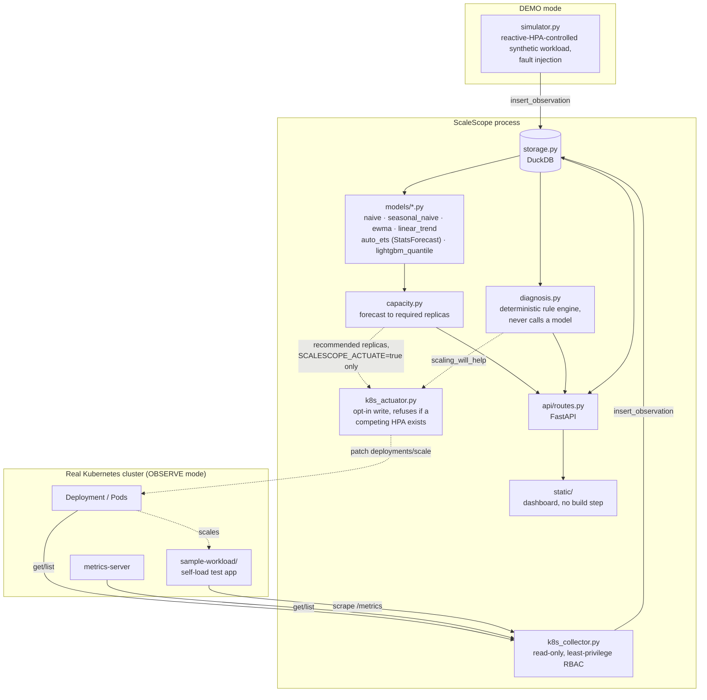
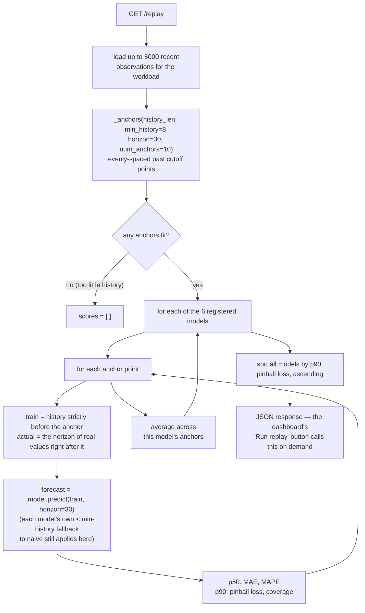
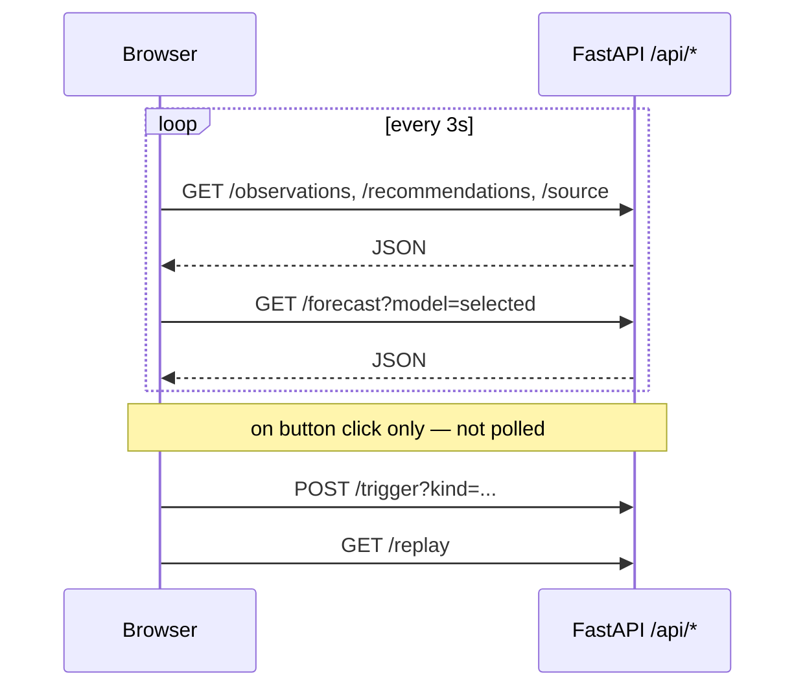
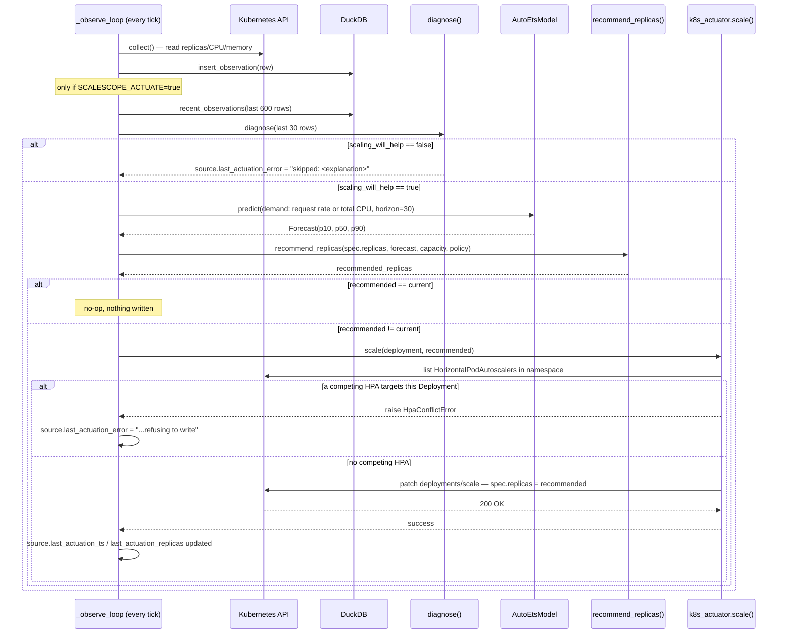
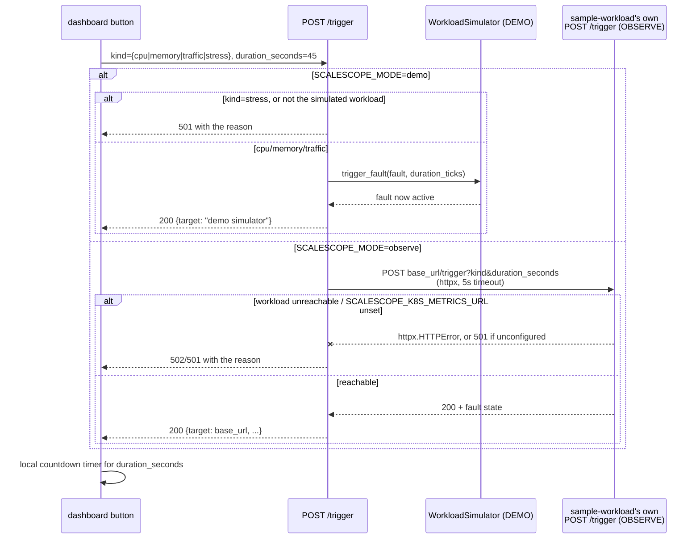

# ScaleScope

Explainable predictive Kubernetes capacity intelligence lab. Forecasts near-term
demand for a workload, computes the replica count required to satisfy it, and
runs that alongside a deterministic diagnosis engine that flags when scaling is
the wrong response (CPU limit throttling, memory leak, node capacity exhaustion,
HPA ceiling, non-CPU bottleneck).

## Status: v0.13.0 (deploy to any cluster with metrics-server; forecasts request rate or total CPU; a plain-language dashboard that shows exactly what the autoscaler would do)

See [CHANGELOG.md](CHANGELOG.md) for what changed at each version.

Created by James Sawyer.

ScaleScope is a working lab with two supported runtime modes:

- **`SCALESCOPE_MODE=demo`** (default): entirely self-contained against a
  synthetic workload simulator, no Kubernetes cluster needed — `docker
  compose up --build` and you're watching data within seconds.
- **`SCALESCOPE_MODE=observe`**: discovers Deployments across
  `SCALESCOPE_K8S_NAMESPACES`, reads their replicas/CPU/memory from the
  Kubernetes API and metrics-server, and shows them as selectable
  `namespace/deployment` targets. Every workload gets a forecast and a
  replica recommendation from **metrics-server alone** (see "What the
  forecast uses"); request rates from Prometheus make it sharper but are
  optional. `latency_p95_ms` and `error_rate` need the workload's own
  metrics endpoint and report `0.0` rather than a fabricated value without it.

## What the forecast uses

| Signal | Source | Used for |
|---|---|---|
| Request rate | the workload's own `/metrics` (`SCALESCOPE_K8S_METRICS_URL`), or one per-pod Prometheus query (`SCALESCOPE_PROMETHEUS_URL`) | **forecast input** when present |
| Total CPU used by all the workload's pods (millicores) | metrics-server | **forecast input** otherwise; per-pod capacity estimate |
| CPU request per pod | the Deployment's pod template | capacity when forecasting CPU |
| Per-pod CPU % of request | metrics-server + pod specs | capacity estimate, diagnosis |
| Replicas: `spec` (desired) and `status` | Kubernetes API | planning from `spec`; capacity estimate from `status` |
| Memory, restarts, pending pods | metrics-server, Kubernetes API | diagnosis only |
| p95 latency, error rate | the workload's own `/metrics` | diagnosis only |
| Disk I/O, network I/O, node pressure | **not collected** | — |

The forecast takes exactly one series per workload, and it must be *demand*:
something adding replicas does not change. Per-pod CPU %, latency, and error
rate all fall when pods are added, so a model trained on them learns the
effect of its own past scaling and under-predicts the next peak. Total CPU
across all pods tracks the work done however many pods share it, which is
why it is the universal fallback. Disk and network I/O are reachable only
through the kubelet (`nodes/proxy`, which also grants exec-level access to
every pod on the node) or cAdvisor; that privilege is not worth a signal
that rarely drives replica counts, so ScaleScope does not ask for it.

## Deploy to any cluster

Requirements: metrics-server (most managed clusters ship it), and CPU
requests on the Deployments you want recommendations for.

```
kubectl apply -k "https://github.com/jsawyerdev/scalescope//k8s/scalescope?ref=v0.13.0"
kubectl -n scalescope-system port-forward svc/scalescope 8000:80
```

That installs the multi-arch (amd64/arm64) image
`ghcr.io/jsawyerdev/scalescope`, published by `.github/workflows/image.yml`,
with read-only cluster-wide RBAC, and observes every Deployment its
ServiceAccount can read. **The step-by-step guide, including configuration,
turning on autoscaling, exposing the dashboard, the sample workload, upgrades,
and troubleshooting, is [examples/README.md](examples/README.md).** Optional:

- `SCALESCOPE_PROMETHEUS_URL`: request rates from one instant query whose
  series carry `namespace` and `pod` labels (default
  `sum by (namespace, pod) (rate(http_requests_total[2m]))`). ScaleScope
  attributes pods to Deployments through their label selectors.
- `SCALESCOPE_CAPACITY_PER_POD_RPS`: requests/s one pod serves at 100% of its
  CPU request. Unset, it is estimated per workload as the median of
  `(request_rate / replicas) / cpu_fraction` over samples between 5% and 95%
  CPU; with too few samples the recommendation keeps the current replica
  count and says the capacity is unknown, instead of guessing.
- Actuation: see "Actuation" below.

## Screenshots

All three captured from a real running DEMO instance (no cluster involved)
against the built-in `sample-app` synthetic workload.

### The dashboard


The page answers three questions in order:

1. **Is everything OK?** A traffic light: green when the current pods cover
   the forecast, amber when a change is recommended or data is slow, red when
   collection has stopped or scaling would not fix the problem.
2. **What would the autoscaler do?** A plain sentence ("Add 1 pod now: 14 →
   15"), why, and the four numbers behind it: demand now, the busy-case peak
   (p90) ahead, what one pod handles, and pods needed at the peak. It always
   uses the model actuation uses, and says whether autoscaling is on or the
   page is advisory only.
3. **What is coming?** Recent demand with the forecast's expected line,
   likely range, and busy case, over a pod strip showing pods running now and
   pods the busy case needs.

Model comparison, the replay lab, raw observations, and cluster identity sit
under a collapsed "Engineering details" section.

### Diagnosis catching a real problem


Clicking "Leak memory" forces the DEMO simulator's memory-leak fault; within a
few ticks `diagnosis.py`'s rule engine (never a model) flags
`POSSIBLE_MEMORY_LEAK`: memory is growing while traffic is flat, so adding
pods would mask the leak, not fix it. The status turns red and the
recommendation holds the pod count instead of asking for more.

### Replay lab


`GET /api/workloads/{name}/replay`, triggered by "Run replay" under
Engineering details, backtests every registered model against this
workload's own recorded history: busy-case (p90) pinball loss and coverage,
which is what sizes pods, plus the expected forecast's MAE/MAPE, sorted best
first by p90 loss. On the short, fault-heavy history in this screenshot the
naive baseline ranks first, which is the point of measuring instead of
assuming.

## Advisory or autoscaling?

Both are supported, but the release default is advisory.

| Deployment shape | Writes replicas? | Intended use |
|---|---:|---|
| DEMO | No | Local dashboard, forecasting, diagnosis, replay, and load-trigger demo |
| OBSERVE advisory | No | Read a real cluster and show recommendations without changing workloads |
| OBSERVE actuation | Yes, opt-in | Patch `deployments/scale` when the forecast recommends a different replica count and diagnosis says scaling will help |

Actuation requires all of the following:

- `SCALESCOPE_MODE=observe`
- `SCALESCOPE_ACTUATE=true`
- RBAC from `k8s/scalescope-actuation/` or equivalent access to
  `deployments/scale`
- no `HorizontalPodAutoscaler` targeting the same Deployment, because
  ScaleScope refuses to fight another replica controller

The dashboard and `GET /api/source` show which cluster identity is connected,
which namespace scope is visible, and whether actuation is enabled.
See [examples/README.md](examples/README.md) for copy-paste deployment paths.

## Architecture



The forecaster never predicts CPU-per-pod directly, because scaling changes
that signal (adding replicas lowers per-pod CPU, which would make the
forecast look self-correcting). It forecasts demand, request rate or total
CPU, which the replica count does not alter, then divides by per-pod
capacity (see "What the forecast uses").

## Forecast models

All six models implement the same `ForecastModel` protocol (`src/scalescope/models/base.py`):
`predict(history, horizon)` on a 1-D demand array (request rate, or total CPU), returning a `Forecast`
of `p10`/`p50`/`p90` arrays. None of them ever sees CPU-per-pod or replica count — see "What the
forecast uses" for why.

The simulated series (`simulator.py`) is a ~300-tick sine-wave daily cycle (amplitude 400 around a
base of 700) plus noise, with occasional faults. Only the `traffic_spike` fault adds directly to
`request_rate` (a flat +600 for the fault's duration); `memory_leak`, `cpu_limit`, and
`node_capacity` faults change memory/CPU/node signals that `diagnosis.py` reads separately — they do
not show up as demand spikes in the series the forecasters fit on.

| Model | Fits on | Min history | Fallback | Reasonable fit | Poor fit |
|---|---|---|---|---|---|
| `naive` | last observed value | none | — | flat/near-term stretches | trending or seasonal periods |
| `seasonal_naive` | the last full cycle of the period `detect_period` finds in the history (the ~300-tick daily cycle in DEMO) | two full cycles (and ≥ 100 ticks) | `naive` until a period is confidently detected | once the cycle is established | cold start, or when a fault in the previous cycle (e.g. a `traffic_spike`) gets replayed |
| `ewma` | exponentially weighted average of the whole history (alpha 0.3), extrapolated flat | none | — | smoothing out noise on a roughly flat series | any series with real trend or seasonality, since it always flattens |
| `linear_trend` | least-squares line over the last 60 points | 8 ticks | `naive` below threshold | short local trends (e.g. climbing into a spike) | the full sine cycle, since a straight line can't turn over |
| `auto_ets` | Nixtla StatsForecast `AutoETS`, exponential-smoothing state space fit to the whole history, 80% prediction interval; seasonal only for a detected period of 24 ticks or less, because StatsForecast's ETS skips every seasonal model above 24 | 30 ticks | `naive`, on short history or if the fit raises | general-purpose statistical fit; best replay MAE on the DEMO series | long cycles (the DEMO's 300-tick cycle is fit without seasonality); MSTL decomposition was measured and rejected: better on clean cycles, worse than naive once faults occur |
| `lightgbm_quantile` | three independent LightGBM quantile regressors (p10/p50/p90) over lag (1,2,3,5,10, plus the detected period when there is one) and rolling mean/std(5) features via MLForecast | 60 ticks | `naive`, on short history or if fitting/predicting raises | has enough history and lag structure to pick up the daily cycle and recent spike dynamics | short or noisy history — 60 ticks is barely two lag windows, and quantile crossing (corrected by sorting p10/p50/p90 per step) signals the fit is unstable |

Every baseline computes its p10/p90 band from the standard deviation of first differences in the
history (`_residual_std`), widened linearly with forecast horizon — it is not a statistically
calibrated interval, just a spread proxy. `auto_ets` and `lightgbm_quantile` produce their bands
directly (ETS's 80% interval; independently fit quantile regressors, respectively).

### Scaling policy

`capacity.py` sizes replicas off `forecast.p90`, not `p50`, at `SCALESCOPE_TARGET_UTILIZATION`
(0.70) of per-pod capacity, within `SCALESCOPE_MIN_REPLICAS`/`SCALESCOPE_MAX_REPLICAS` and at most
+4/-2 replicas per decision. Sizing to the median would under-provision for roughly half the
horizon by definition. The rule is deliberately asymmetric:

- **Scale up** for the p90 peak within the pod startup lead (15 ticks): pods started now are ready
  just in time, and later peaks can wait.
- **Scale down** only if the p90 peak over the *whole* horizon fits in fewer pods, so no pod is
  removed that the forecast says will be needed again.

Measured offline on 2,400-tick DEMO demand series with random faults (3 seeds, pods ready 15 ticks
after a scale-up, AutoETS forecasts), against the previous rule, which scaled both ways on the
startup-lead peak:

| Policy | Under-provisioned ticks | Avg pods | Direction flips |
|---|---|---|---|
| previous rule | 0.00% / 1.22% / 0.11% | 5.92 / 6.75 / 6.72 | 81 / 137 / 142 |
| asymmetric rule (this release) | 0.00% / 1.22% / 0.00% | 6.05 / 6.91 / 6.88 | 15 / 25 / 20 |
| asymmetric + 300s HPA-style stabilization | 0.00% / 0.00% / 0.00% | 8.48 / 10.48 / 9.26 | 12 / 7 / 9 |
| reactive HPA on current demand, 300s stabilization | 0.00% / 0.00% / 0.00% | 7.45 / 8.27 / 8.00 | 12 / 10 / 11 |

The asymmetric rule cuts scale-direction reversals 5-7x for about 2% more pods, and uses about 14%
fewer pods than a reactive HPA. Its misses (seed 2) are sudden traffic spikes no forecast
anticipates, which a reactive HPA avoids only by holding more pods. Actuation can add the HPA's
scale-down stabilization with `SCALESCOPE_SCALE_DOWN_STABILIZATION_SECONDS`; it defaults to 0 because
on this data it bought fewer flips at 30-50% more pods.

`confidence` in the response is derived from the mean P90-minus-P10 band width relative to peak
demand. Forecasts below `MIN_CONFIDENCE_TO_SCALE` (0.10) are still shown for comparison, but they
keep the current replica count instead of driving a scale change. So does unknown per-pod capacity.

`GET /api/workloads/{name}/recommendations` (plural) runs every registered model against the same
history and returns all six recommendations side by side, so the dashboard can compare them instead
of committing to one model's output blind. `GET /api/workloads/{name}/recommendation` (singular)
still exists for a single `model=` choice.

Operator-run SMAC3 tuning for `lightgbm_quantile` lives in
[`scripts/tune`](scripts/tune/README.md). It writes an opt-in JSON config for
`SCALESCOPE_LIGHTGBM_CONFIG_PATH`; SMAC3 stays out of the app dependency set.
The same directory also includes a cron-safe periodic re-tuning driver that
copies current DuckDB data from a running compose service, compares the deployed
config against the new candidate on that data, and only restarts services after
a real promotion.

## Diagnosis logic

`diagnosis.py`'s rule ladder, in the exact order `diagnose()` evaluates it. Every
branch that returns `scaling_will_help=false` is a case where adding replicas
would not fix — or would actively mask — the real problem:


Node capacity and CPU-limit checks run on the single latest row (no window
needed); the memory-leak and non-CPU-bottleneck checks need at least 10 rows
of the last-30-row window to compute a slope/delta, so they're skipped (not
failed) below that. `diagnose()` never calls a model — it is deliberately
readable and reviewable independent of any forecast.

## Replay lab

`GET /api/workloads/{name}/replay` (`src/scalescope/replay.py`) answers
"which model actually performs best on this workload's real data," measured,
not asserted — the same "don't take a stated preference on faith" discipline
`diagnosis.py` applies to scaling decisions, applied to model selection:



Replicas are sized from the p90 forecast, so models are ranked on it:
pinball (quantile) loss at 0.9, which charges an under-forecast nine times
more than an over-forecast, and coverage, the share of actual values at or
below p90 (0.90 is calibrated; lower under-provisions, higher wastes pods).
MAE/MAPE of the median stay alongside for comparison.

On a 5,000-tick DEMO series the result is not flattering to the ML models:

| Model | p90 pinball loss | p90 coverage | p50 MAE |
|---|---|---|---|
| `naive` | 20.86 | 0.833 | 96.08 |
| `linear_trend` | 21.95 | 0.720 | 115.39 |
| `auto_ets` | 23.43 | **0.933** | **90.55** |
| `ewma` | 25.20 | 0.767 | 103.10 |
| `lightgbm_quantile` | 36.87 | 0.850 | 102.20 |
| `seasonal_naive` | 72.88 | 0.780 | 201.17 |

`auto_ets`, the model actuation uses, has the best median error and the only
calibrated p90; the naive baseline's slightly lower pinball loss comes from a
band that is under-covered. LightGBM, trained per request on 600 points,
does not beat naive here. Run the replay on your own workloads before
trusting any model's ranking: this table is one synthetic series.

Deliberately scoped: this backtests a model's forecast against what the
workload's own metrics actually did next, not against what a real
Kubernetes HPA would have decided over the same window — see "Known
limitations" below. It also runs on demand rather than the dashboard's 3s poll
cycle: retraining all 6 models across 10 anchor points on 5,000 rows takes
about 7 seconds.

## Run it

```
docker compose up --build
```

Then open http://localhost:8000. A synthetic workload (`sample-app`) starts
generating observations immediately; the dashboard begins populating within a
few seconds. Data persists in the `scalescope-data` volume across restarts.
The dashboard ships its own DejaVu Sans Mono Regular font and uses that same
face for labels, tables, charts, and metric values.

Environment variables (see `src/scalescope/config.py`):

| Variable | Default | Meaning |
|---|---|---|
| `SCALESCOPE_MODE` | `demo` | `demo` runs the synthetic simulator; `observe` reads a real cluster |
| `SCALESCOPE_TICK_SECONDS` | `2.0` | Seconds between observations (both modes) |
| `SCALESCOPE_DB_PATH` | `/data/scalescope.duckdb` | DuckDB file path |
| `SCALESCOPE_LOG_LEVEL` | `INFO` | Python logging level |
| `SCALESCOPE_HORIZON_STEPS` | `30` | Forecast horizon, in ticks |
| `SCALESCOPE_HISTORY_STEPS` | `600` | Observation history window fed to models |
| `SCALESCOPE_LIGHTGBM_CONFIG_PATH` | unset | Optional LightGBM hyperparameter JSON produced by `scripts/tune` |
| `SCALESCOPE_K8S_NAMESPACE` | `scalescope-demo` | Primary namespace for metrics URL attachment and opt-in actuation |
| `SCALESCOPE_K8S_DEPLOYMENT` | `sample-workload` | Primary deployment for metrics URL attachment and opt-in actuation |
| `SCALESCOPE_K8S_NAMESPACES` | `SCALESCOPE_K8S_NAMESPACE` | Comma-separated namespaces to discover in OBSERVE mode; `*` lists all namespaces visible to the ServiceAccount |
| `SCALESCOPE_K8S_KUBECONFIG` | unset | Kubeconfig path; unset tries in-cluster config, then default kubeconfig discovery |
| `SCALESCOPE_K8S_METRICS_URL` | unset | Primary workload's own `/metrics` URL, for real `request_rate`/`latency_p95_ms`/`error_rate` and `/trigger` proxying |
| `SCALESCOPE_PROMETHEUS_URL` | unset | Optional Prometheus base URL for per-pod request rates (see "Deploy to any cluster") |
| `SCALESCOPE_PROMETHEUS_RPS_QUERY` | `sum by (namespace, pod) (rate(http_requests_total[2m]))` | Instant query; series must carry `namespace` and `pod` labels |
| `SCALESCOPE_CAPACITY_PER_POD_RPS` | unset | Requests/s one pod serves at 100% of its CPU request; unset estimates it per workload |
| `SCALESCOPE_TARGET_UTILIZATION` | `0.70` | Fraction of per-pod capacity to size for, in (0, 1] |
| `SCALESCOPE_MIN_REPLICAS` / `SCALESCOPE_MAX_REPLICAS` | `1` / `30` | Bounds on every recommendation; the max is also the diagnosis engine's HPA ceiling |
| `SCALESCOPE_SCALE_DOWN_STABILIZATION_SECONDS` | `0` | Actuation only: hold scale-downs at the highest recommendation of this window (HPA default is 300) |
| `SCALESCOPE_RETENTION_HOURS` | `24` | Observations older than this are pruned |
| `SCALESCOPE_ACTUATE` | `false` | Observe mode only: actually write recommended replica counts to the cluster (see "Actuation" below) |
| `SCALESCOPE_AUTH_USERNAME` | unset | HTTP Basic Auth username for every route (see "Authentication" below) |
| `SCALESCOPE_AUTH_PASSWORD` | unset | HTTP Basic Auth password; both must be set together |

To fully tear down and rebuild against the latest dependency versions
`pyproject.toml` allows, run `./scripts/rebuild.sh`. It records the resolved
package set to `requirements-lock.txt` and leaves the service(s) running
(via `docker compose`) once built and health-checked.

- `./scripts/rebuild.sh` — DEMO instance only (`localhost:8000`).
- `./scripts/rebuild.sh --observe` — also tears down/rebuilds the OBSERVE
  instance (`localhost:8001`); requires `k8s/rbac/` already applied and a
  kubeconfig from `generate-observer-kubeconfig.sh` (see below).
- `./scripts/rebuild.sh --wipe-data` — also drops the DuckDB volume(s), for
  a clean-slate rebuild instead of preserving history across it.

### Verify a running instance

For DEMO mode, these checks should all return HTTP 200 after either
`docker compose up --build` or `./scripts/rebuild.sh`:

```
curl -fs http://localhost:8000/healthz
curl -fs http://localhost:8000/api/source
curl -fs http://localhost:8000/api/workloads
curl -fs "http://localhost:8000/api/workloads/sample-app/recommendations"
```

If Basic Auth is enabled, add
`-u "$SCALESCOPE_AUTH_USERNAME:$SCALESCOPE_AUTH_PASSWORD"` to the API
requests. `./scripts/rebuild.sh` performs these smoke checks automatically
and leaves the healthy service running.

For OBSERVE mode, replace the URL with `http://localhost:8001` for local
Docker OBSERVE mode, or port-forward the in-cluster Service first:

```
kubectl -n scalescope-system port-forward svc/scalescope 8000:80
curl -fs http://localhost:8000/api/source
curl -fs http://localhost:8000/api/workloads
```

`/api/source` should show `mode: observe`, `connected: true`, the cluster
server, the authentication identity, and the namespace scope. Workload IDs
are returned as `namespace:deployment`; use one of those IDs when calling
forecast, recommendation, diagnosis, replay, or trigger endpoints.

### Authentication

Both `SCALESCOPE_AUTH_USERNAME` and `SCALESCOPE_AUTH_PASSWORD` unset (the
default): no authentication — every route, including the dashboard itself,
is open. This is an explicit supported mode for trusted-LAN or homelab
operators who deliberately accept that risk. Setting exactly one of the two
auth variables is a startup configuration error; ScaleScope refuses that
state rather than silently disabling auth. Running without credentials logs
a startup warning (including when `SCALESCOPE_ACTUATE=true`) and still starts.
Set both variables to enable HTTP Basic Auth
(`src/scalescope/auth.py`, applied as ASGI middleware so it covers the
static dashboard files as well as `/api/*`, not just the API):

- `GET /healthz` is the one exempt route (unauthenticated liveness check;
  the Docker `HEALTHCHECK` uses it).
- Browsers handle the login prompt natively — no dashboard login form was
  built. The first page load triggers the browser's built-in Basic Auth
  dialog; credentials are then cached by the browser and attached to every
  subsequent `fetch()` call automatically.
- `docker-compose.yml` passes `SCALESCOPE_AUTH_USERNAME`/`_PASSWORD`
  through from `.env` to both services if set there (see
  `.env.example`). `scripts/rebuild.sh`'s own smoke-test curls read the
  same `.env` file directly and authenticate if configured.

### Release security model

ScaleScope ships with a safe default network shape, not a universal
authentication policy. The Kubernetes Service in `k8s/scalescope/` is
`ClusterIP`, OBSERVE mode is read-only unless actuation is explicitly enabled,
and the optional Basic Auth Secret provides a simple app-level guard for demos,
homelabs, and trusted internal paths.

Production operators are responsible for the exposure layer that matches their
environment. Do not expose ScaleScope unauthenticated on an untrusted network;
configure either `SCALESCOPE_AUTH_USERNAME`/`SCALESCOPE_AUTH_PASSWORD` through
the `scalescope-auth` Secret, or put the Service behind an ingress, gateway,
VPN, SSO proxy, mTLS policy, or other organization-approved control with TLS.

Namespace visibility is also a deployment-time authorization decision.
ScaleScope only discovers and displays the namespaces and Deployments its
ServiceAccount can read. For least privilege, bind the ServiceAccount to the
specific namespaces users are allowed to inspect; use
`SCALESCOPE_K8S_NAMESPACES=*` only when cluster-wide visibility is intended.
Apply `k8s/scalescope-actuation/` and set `SCALESCOPE_ACTUATE=true` only for
environments where ScaleScope is authorized to change replica counts.

### What the dashboard fetches, and when

`static/app.js`'s `refresh()` runs every `POLL_INTERVAL_MS` (3s) and fetches
only the selected model's forecast; the recommendations call already carries
every model's replica decision. Replay and load triggers are explicit button
actions, never polled. Chart.js is vendored under `static/vendor/`, so the
dashboard needs no internet access:



## Wiring in a real cluster (OBSERVE mode)

`src/scalescope/k8s_collector.py` discovers Deployments in
`SCALESCOPE_K8S_NAMESPACES` and reads each target's state via the Kubernetes
API (`get`/`list` on Deployments and Pods, `get`/`list` on
metrics.k8s.io PodMetrics if metrics-server is installed). Workloads are
stored as `namespace:deployment`, and the dashboard labels them as
`namespace/deployment` so users can choose the target they want recommendations
for.

For a real in-cluster install (the published `ghcr.io/jsawyerdev/scalescope`
image; override it with a kustomize overlay to use your own registry):

```
kubectl apply -k k8s/scalescope
kubectl -n scalescope-system port-forward svc/scalescope 8000:80
```

The bundled Service is `ClusterIP`, so it is internal to the cluster unless
you add an Ingress, load balancer, or port-forward. If you expose it beyond a
trusted local demo path, create the optional Basic Auth Secret before rolling
the Deployment:

```
kubectl -n scalescope-system create secret generic scalescope-auth \
  --from-literal=username="$SCALESCOPE_AUTH_USERNAME" \
  --from-literal=password="$SCALESCOPE_AUTH_PASSWORD"
```

`k8s/scalescope/` is observe-only. To let ScaleScope write replica counts as
well, set `SCALESCOPE_ACTUATE=true` on the Deployment and apply the separate
actuation RBAC:

```
kubectl apply -f k8s/scalescope-actuation/
```

For local Docker OBSERVE mode, `k8s/rbac/` still defines a namespace-scoped
identity and standalone kubeconfig:

1. `kubectl apply -f k8s/rbac/` — creates the `scalescope-demo` namespace, a
   `scalescope-actuator` ServiceAccount, a namespace-scoped Role (the read
   verbs above, plus write access scoped to the `deployments/scale`
   subresource only — never full deployments, so this identity can change a
   replica count and nothing else about the workload — and read access to
   `horizontalpodautoscalers` for the conflict check below; no secrets
   access beyond its own token, nothing cluster-scoped), and a durable
   token Secret for it.
2. `./scripts/generate-observer-kubeconfig.sh` — renders a standalone
   kubeconfig for that ServiceAccount (`OUTPUT_PATH` env var to change where
   it's written; defaults to `./scalescope-observer.kubeconfig`). **This file
   contains a live cluster credential — never commit it** (already covered by
   `.gitignore`).
3. Deploy something to observe — `sample-workload/` (below) is a ready-made
   test target. Then either `./scripts/rebuild.sh --observe` (brings up
   both DEMO and OBSERVE via `docker compose`, reading `SCALESCOPE_K8S_*`
   overrides from `.env` — see `.env.example`), or run ScaleScope directly
   with `SCALESCOPE_MODE=observe`, `SCALESCOPE_K8S_KUBECONFIG` pointed at
   the generated file, and `SCALESCOPE_K8S_NAMESPACE`/
   `SCALESCOPE_K8S_DEPLOYMENT` set to match.

Verify the identity is actually scoped before trusting it:
`kubectl --kubeconfig=./scalescope-observer.kubeconfig auth can-i delete pods -n scalescope-demo`
must say `no`.

`GET /api/source` reports what a running instance is actually observing —
mode, cluster server address, namespace/deployment, and live connection
status — so DEMO and OBSERVE are never visually ambiguous in the dashboard.

### Actuation: letting ScaleScope actually change replica counts

`SCALESCOPE_MODE=observe` alone is always read-only. Setting
`SCALESCOPE_ACTUATE=true` on top of it makes the observe loop, every tick,
compute a recommendation and — only if the diagnosis engine says scaling
will actually help and per-pod capacity is known — call
`src/scalescope/k8s_actuator.py` to patch the target Deployment's
`spec.replicas` via the `deployments/scale` subresource. Each decision starts
from the Deployment's `spec.replicas`, not `status.replicas`: status lags a
write by as long as pods take to start, and planning from it would re-issue
the same step every tick instead of taking the next one.

**Before writing, it checks whether a `HorizontalPodAutoscaler` already
targets the same Deployment, and refuses if one does.** Two controllers
writing the same replica count fight each other: the HPA reconciles
continuously and will simply overwrite ScaleScope's write within seconds,
so the *only* safe default is refusing outright, not warning and
proceeding. `sample-workload/k8s/hpa.yaml` installs a real HPA on the demo
target by design (so there's a baseline to compare against) — actuation
against it will therefore refuse until you remove that HPA
(`kubectl delete hpa sample-workload -n scalescope-demo`) and let
ScaleScope be the sole controller.

`GET /api/source` also reports actuation state: `actuate`,
`last_actuation_ts`, `last_actuation_replicas`, and
`last_actuation_error` (populated whether the failure was an HPA conflict
or an API error, so "why didn't it scale" is never a silent question) -
the dashboard sidebar shows this as an "actuation" row whenever
`actuate=true` in observe mode.

Exact sequence, once per tick, straight from `main.py`'s `_observe_loop` /
`_actuate` and `k8s_actuator.py`'s `scale`:



### sample-workload/

A self-contained FastAPI test target with no external load generator
required: a background task randomizes its own CPU load, a bounded
self-recovering simulated memory leak, and error injection, so deploying it
alone produces a real, varying pattern for a Kubernetes HPA (and ScaleScope)
to react to. Exposes `sample_workload_demand_rps`/`latency_p95_ms`/
`error_rate` Prometheus gauges — point `SCALESCOPE_K8S_METRICS_URL` at its
`/metrics` endpoint to get real values for those fields instead of `0.0`.
Its own `/timeline/pause`, `/timeline/resume`, and `/timeline/status`
endpoints can freeze the background phase progression during controlled
OBSERVE-mode tests.
See `sample-workload/README.md` for build/push/deploy instructions.

## On-demand load triggers

The dashboard's "Generate load" buttons call `POST /api/workloads/{name}/trigger`,
which forces a pattern immediately instead of waiting for it to occur
naturally, so its effect on the metrics and diagnosis is visible within a
few ticks. The route branches on `SCALESCOPE_MODE` (from `api/routes.py`'s
`trigger_fault`):



`stress` is OBSERVE-only because it runs a real bounded CPU worker inside
sample-workload processes; the synthetic DEMO simulator has no equivalent
process to stress. `base_url` is derived from
`SCALESCOPE_K8S_METRICS_URL` (its `/metrics` suffix stripped) —
ScaleScope has no other route to the workload's process, so OBSERVE-mode
triggers require that variable to be set.

## API

- `GET /healthz` — unauthenticated liveness check, the only exempt route
  when Basic Auth is enabled (see "Authentication" above)
- `GET /api/workloads`
- `GET /api/workloads/{name}/observations?limit=300`
- `GET /api/workloads/{name}/forecast?model={naive|seasonal_naive|ewma|linear_trend|auto_ets|lightgbm_quantile}`
- `GET /api/workloads/{name}/diagnosis`
- `GET /api/workloads/{name}/recommendation?model=...`
- `GET /api/workloads/{name}/recommendations` — all six models, side by side
- `GET /api/workloads/{name}/replay` — backtests every model against this
  workload's recorded history (MAE/MAPE, sorted best first) — what the
  dashboard's "Replay lab" panel calls on demand
- `GET /api/source` — what this instance is actually observing (mode, cluster, connection status)
- `POST /api/workloads/{name}/trigger?kind={cpu|memory|traffic|stress}&duration_seconds=45` — force a load
  pattern now (DEMO: the local simulator; OBSERVE: proxied to the real workload's own `/trigger`,
  requires `SCALESCOPE_K8S_METRICS_URL`; `stress` is OBSERVE-only) — what the dashboard's
  "Generate load" buttons call

## Develop locally

```
python3.14 -m venv .venv && source .venv/bin/activate
pip install -e ".[dev]"
uvicorn scalescope.main:app --reload
pytest
mypy
black src tests sample-workload/app scripts/tune
ruff check .
```

## License

ScaleScope is licensed under the Apache License 2.0. Copyright 2026 James
Sawyer. See [LICENSE](LICENSE) and [NOTICE](NOTICE).

The bundled DejaVu Sans Mono Regular font keeps its own license in
`src/scalescope/static/fonts/DejaVu-LICENSE.txt`, and the vendored Chart.js
4.5.1 (MIT) in `src/scalescope/static/vendor/Chart.js-LICENSE.md`.

## Concurrency and consistency

- **Deadlocks**: every lock is a plain `threading.Lock`, and none is ever
  acquired while another is held (the DuckDB store lock, the forecast cache
  lock, and the sample workload's override/timeline/stress locks). Store
  calls from the collection loops run off the event loop, so a long API
  query can delay a write but never stall health checks.
- **Memory**: observations are pruned after `SCALESCOPE_RETENTION_HOURS`;
  the forecast cache is an LRU of 2,048 entries. RSS stayed flat at ~390 MB
  across 180 full six-model retrains in a soak test.
- **N+1**: collection costs one Deployment list, plus one Pod list and one
  PodMetrics list per namespace, plus at most one Prometheus query per tick,
  regardless of how many Deployments there are. API requests read the store
  once each.
- **No distributed lock**: run exactly one ScaleScope replica. The manifest
  uses `replicas: 1`, `Recreate`, and a `ReadWriteOnce` volume, and DuckDB
  refuses a second writer on the same file, so a second actuating replica
  fails to start rather than double-writing. There is no leader election.
- **Eventual consistency**: planning uses `spec.replicas` (see "Actuation");
  metrics-server usage trails reality by its scrape interval (15-60s), which
  the median-based capacity estimate absorbs; the HPA-conflict check and the
  scale write are not atomic, so an HPA created between them is caught on
  the next tick.

## Known limitations

- **`cpu_throttled_pct` in OBSERVE mode**: needs cAdvisor
  `container_cpu_cfs_throttled` data, reachable only through the kubelet
  (`nodes/proxy`); always `0.0` when observing a real cluster.
- **Replay lab vs. real HPA behavior**: the replay lab scores forecasts, not
  scaling decisions. The policy comparison in "Scaling policy" was run
  offline on synthetic demand; it is not yet a product feature.
- **Latency and error rate** come only from the primary target's
  `SCALESCOPE_K8S_METRICS_URL`, so the non-CPU-bottleneck diagnosis only
  applies there.
- **Linear CPU model**: capacity from CPU assumes CPU usage scales linearly
  with work. Workloads bound by memory, I/O, or a downstream dependency need
  `SCALESCOPE_CAPACITY_PER_POD_RPS` set from a load test instead.
