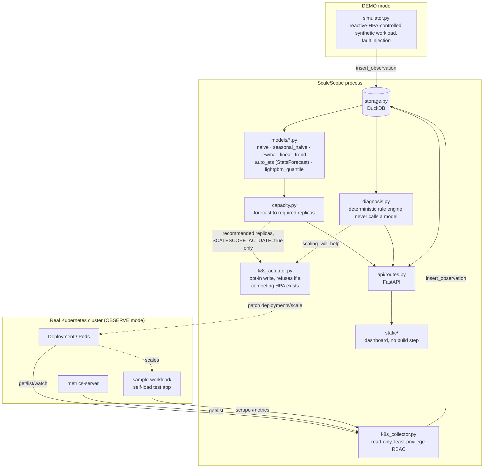

# ScaleScope

Explainable predictive Kubernetes capacity intelligence lab. Forecasts near-term
demand for a workload, computes the replica count required to satisfy it, and
runs that alongside a deterministic diagnosis engine that flags when scaling is
the wrong response (CPU limit throttling, memory leak, node capacity exhaustion,
HPA ceiling, non-CPU bottleneck).

## Status: v0.5 (demo + observe + opt-in actuation + on-demand load triggers, verified against a real cluster)

See [CHANGELOG.md](CHANGELOG.md) for what changed at each version.

This is a scaffold, not a finished product. Two ways to run it:

- **`SCALESCOPE_MODE=demo`** (default): entirely self-contained against a
  synthetic workload simulator, no Kubernetes cluster needed — `docker
  compose up --build` and you're watching data within seconds.
- **`SCALESCOPE_MODE=observe`**: reads a real Deployment's replicas/CPU/memory
  from the Kubernetes API and metrics-server, read-only, via a least-privilege
  RBAC identity — see "Wiring in a real cluster" below. `request_rate`,
  `latency_p95_ms`, and `error_rate` require the workload to expose those as
  Prometheus gauges (not derivable from the Kubernetes API alone); without
  that they report as `0.0` rather than a fabricated value.

The online-learning drift detector (River), foundation-model forecasters
(Chronos-2/TimesFM via Darts), the model leaderboard, the replay lab, and
KEDA-based actuation are on the roadmap and not implemented yet — see
"Not yet built" below.

## Architecture



The forecaster never predicts CPU-per-pod directly, because scaling changes
that signal (adding replicas lowers per-pod CPU, which would make the
forecast look self-correcting). It forecasts `request_rate` — a demand signal
that is not mechanically altered by the replica count — then derives
required capacity from a fixed per-pod throughput assumption.

## Forecast models

All six models implement the same `ForecastModel` protocol (`src/scalescope/models/base.py`):
`predict(history, horizon)` on a 1-D `request_rate` array, returning a `Forecast` of `p10`/`p50`/`p90`
arrays. None of them ever sees CPU-per-pod or replica count — see "Architecture" above for why.

The simulated series (`simulator.py`) is a ~300-tick sine-wave daily cycle (amplitude 400 around a
base of 700) plus noise, with occasional faults. Only the `traffic_spike` fault adds directly to
`request_rate` (a flat +600 for the fault's duration); `memory_leak`, `cpu_limit`, and
`node_capacity` faults change memory/CPU/node signals that `diagnosis.py` reads separately — they do
not show up as demand spikes in the series the forecasters fit on.

| Model | Fits on | Min history | Fallback | Reasonable fit | Poor fit |
|---|---|---|---|---|---|
| `naive` | last observed value | none | — | flat/near-term stretches | trending or seasonal periods |
| `seasonal_naive` | value from 150 ticks ago (half the ~300-tick daily cycle) | 150 + 8 ticks | `naive` below threshold | once the daily cycle is established | cold start, or after a regime change (e.g. mid-`traffic_spike`) |
| `ewma` | exponentially weighted average of the whole history (alpha 0.3), extrapolated flat | none | — | smoothing out noise on a roughly flat series | any series with real trend or seasonality, since it always flattens |
| `linear_trend` | least-squares line over the last 60 points | 8 ticks | `naive` below threshold | short local trends (e.g. climbing into a spike) | the full sine cycle, since a straight line can't turn over |
| `auto_ets` | Nixtla StatsForecast `AutoETS`, exponential-smoothing state space fit to the whole history, 80% prediction interval | 30 ticks | `naive`, on short history or if the fit raises | general-purpose statistical fit; better than the baselines once enough history exists | `season_length=1` is passed (no periodicity told to the model), so it does not exploit the known 300-tick cycle either |
| `lightgbm_quantile` | three independent LightGBM quantile regressors (p10/p50/p90) over lag (1,2,3,5,10) and rolling mean/std(5) features via MLForecast | 60 ticks | `naive`, on short history or if fitting/predicting raises | has enough history and lag structure to pick up the daily cycle and recent spike dynamics | short or noisy history — 60 ticks is barely two lag windows, and quantile crossing (corrected by sorting p10/p50/p90 per step) signals the fit is unstable |

Every baseline computes its p10/p90 band from the standard deviation of first differences in the
history (`_residual_std`), widened linearly with forecast horizon — it is not a statistically
calibrated interval, just a spread proxy. `auto_ets` and `lightgbm_quantile` produce their bands
directly (ETS's 80% interval; independently fit quantile regressors, respectively).

`capacity.py` sizes replicas off `forecast.p90`, not `p50`: `recommend_replicas` takes the max of
the P90 window as `peak_demand` and requires enough replicas to serve that peak at
`TARGET_UTILIZATION` (0.70). Sizing to the median would under-provision for roughly half the
horizon by definition; sizing to the upper quantile is a deliberate peak-not-average safety margin.
`confidence` in the response is derived from the mean P90-minus-P10 band width relative to peak
demand — a wide band lowers confidence rather than being ignored.

`GET /api/workloads/{name}/recommendations` (plural) runs every registered model against the same
history and returns all six recommendations side by side, so the dashboard can compare them instead
of committing to one model's output blind. `GET /api/workloads/{name}/recommendation` (singular)
still exists for a single `model=` choice.

## Run it

```
docker compose up --build
```

Then open http://localhost:8000. A synthetic workload (`payments-api`) starts
generating observations immediately; the dashboard begins populating within a
few seconds. Data persists in the `scalescope-data` volume across restarts.

Environment variables (see `src/scalescope/config.py`):

| Variable | Default | Meaning |
|---|---|---|
| `SCALESCOPE_MODE` | `demo` | `demo` runs the synthetic simulator; `observe` reads a real cluster |
| `SCALESCOPE_TICK_SECONDS` | `2.0` | Seconds between observations (both modes) |
| `SCALESCOPE_DB_PATH` | `/data/scalescope.duckdb` | DuckDB file path |
| `SCALESCOPE_LOG_LEVEL` | `INFO` | Python logging level |
| `SCALESCOPE_HORIZON_STEPS` | `30` | Forecast horizon, in ticks |
| `SCALESCOPE_HISTORY_STEPS` | `600` | Observation history window fed to models |
| `SCALESCOPE_K8S_NAMESPACE` | `scalescope-demo` | Namespace to observe (observe mode only) |
| `SCALESCOPE_K8S_DEPLOYMENT` | `sample-workload` | Deployment to observe (observe mode only) |
| `SCALESCOPE_K8S_KUBECONFIG` | unset | Kubeconfig path; unset tries in-cluster config, then default kubeconfig discovery |
| `SCALESCOPE_K8S_METRICS_URL` | unset | Workload's own `/metrics` URL, for real `request_rate`/`latency_p95_ms`/`error_rate` |
| `SCALESCOPE_ACTUATE` | `false` | Observe mode only: actually write recommended replica counts to the cluster (see "Actuation" below) |

To fully tear down and rebuild against the latest dependency versions
`pyproject.toml` allows, run `./scripts/rebuild.sh`. It records the resolved
package set to `requirements-lock.txt` and leaves the service(s) running
(via `docker compose`) once built and health-checked.

- `./scripts/rebuild.sh` — DEMO instance only (`localhost:8000`).
- `./scripts/rebuild.sh --observe` — also tears down/rebuilds the OBSERVE
  instance (`localhost:8001`); requires `k8s/rbac/` already applied and a
  kubeconfig from `generate-observer-kubeconfig.sh` (see below).
- `./scripts/rebuild.sh --wipe-data` — also drops the DuckDB volume(s), for
  a clean-slate rebuild instead of preserving history across it.

## Wiring in a real cluster (OBSERVE mode)

`src/scalescope/k8s_collector.py` reads a single Deployment's state via the
Kubernetes API (`get`/`list`/`watch` on Deployments and Pods, `get`/`list` on
metrics.k8s.io PodMetrics if metrics-server is installed) — it never writes
to the cluster. `k8s/rbac/` defines a least-privilege identity for this:

1. `kubectl apply -f k8s/rbac/` — creates the `scalescope-demo` namespace, a
   `scalescope-actuator` ServiceAccount, a namespace-scoped Role (the read
   verbs above, plus write access scoped to the `deployments/scale`
   subresource only — never full deployments, so this identity can change a
   replica count and nothing else about the workload — and read access to
   `horizontalpodautoscalers` for the conflict check below; no secrets
   access beyond its own token, nothing cluster-scoped), and a durable
   token Secret for it.
2. `./scripts/generate-observer-kubeconfig.sh` — renders a standalone
   kubeconfig for that ServiceAccount (`OUTPUT_PATH` env var to change where
   it's written; defaults to `./scalescope-observer.kubeconfig`). **This file
   contains a live cluster credential — never commit it** (already covered by
   `.gitignore`).
3. Deploy something to observe — `sample-workload/` (below) is a ready-made
   test target. Then either `./scripts/rebuild.sh --observe` (brings up
   both DEMO and OBSERVE via `docker compose`, reading `SCALESCOPE_K8S_*`
   overrides from `.env` — see `.env.example`), or run ScaleScope directly
   with `SCALESCOPE_MODE=observe`, `SCALESCOPE_K8S_KUBECONFIG` pointed at
   the generated file, and `SCALESCOPE_K8S_NAMESPACE`/
   `SCALESCOPE_K8S_DEPLOYMENT` set to match.

Verify the identity is actually scoped before trusting it:
`kubectl --kubeconfig=./scalescope-observer.kubeconfig auth can-i delete pods -n scalescope-demo`
must say `no`.

`GET /api/source` reports what a running instance is actually observing —
mode, cluster server address, namespace/deployment, and live connection
status — so DEMO and OBSERVE are never visually ambiguous in the dashboard.

### Actuation: letting ScaleScope actually change replica counts

`SCALESCOPE_MODE=observe` alone is always read-only. Setting
`SCALESCOPE_ACTUATE=true` on top of it makes the observe loop, every tick,
compute a recommendation and — only if the diagnosis engine says scaling
will actually help — call `src/scalescope/k8s_actuator.py` to patch the
target Deployment's `spec.replicas` via the `deployments/scale`
subresource.

**Before writing, it checks whether a `HorizontalPodAutoscaler` already
targets the same Deployment, and refuses if one does.** Two controllers
writing the same replica count fight each other: the HPA reconciles
continuously and will simply overwrite ScaleScope's write within seconds,
so the *only* safe default is refusing outright, not warning and
proceeding. `sample-workload/k8s/hpa.yaml` installs a real HPA on the demo
target by design (so there's a baseline to compare against) — actuation
against it will therefore refuse until you remove that HPA
(`kubectl delete hpa sample-workload -n scalescope-demo`) and let
ScaleScope be the sole controller.

`GET /api/source` also reports actuation state: `actuate`,
`last_actuation_ts`, `last_actuation_replicas`, and
`last_actuation_error` (populated whether the failure was an HPA conflict
or an API error, so "why didn't it scale" is never a silent question) -
the dashboard sidebar shows this as an "actuation" row whenever
`actuate=true` in observe mode.

### sample-workload/

A self-contained FastAPI test target with no external load generator
required: a background task randomizes its own CPU load, a bounded
self-recovering simulated memory leak, and error injection, so deploying it
alone produces a real, varying pattern for a Kubernetes HPA (and ScaleScope)
to react to. Exposes `sample_workload_demand_rps`/`latency_p95_ms`/
`error_rate` Prometheus gauges — point `SCALESCOPE_K8S_METRICS_URL` at its
`/metrics` endpoint to get real values for those fields instead of `0.0`.
See `sample-workload/README.md` for build/push/deploy instructions.

## API

- `GET /api/workloads`
- `GET /api/workloads/{name}/observations?limit=300`
- `GET /api/workloads/{name}/forecast?model={naive|seasonal_naive|ewma|linear_trend|auto_ets|lightgbm_quantile}`
- `GET /api/workloads/{name}/diagnosis`
- `GET /api/workloads/{name}/recommendation?model=...`
- `GET /api/workloads/{name}/recommendations` — all six models, side by side
- `GET /api/source` — what this instance is actually observing (mode, cluster, connection status)
- `POST /api/workloads/{name}/trigger?kind={cpu|memory|traffic}&duration_seconds=45` — force a load
  pattern now (DEMO: the local simulator; OBSERVE: proxied to the real workload's own `/trigger`,
  requires `SCALESCOPE_K8S_METRICS_URL`) — what the dashboard's "Generate load" buttons call

## Develop locally

```
python3.13 -m venv .venv && source .venv/bin/activate
pip install -e ".[dev]"
uvicorn scalescope.main:app --reload
pytest
ruff check src tests
```

## Not yet built (roadmap, not implemented)

- **`cpu_throttled_pct` in OBSERVE mode**: needs cAdvisor
  `container_cpu_cfs_throttled` data, not exposed by the Kubernetes API or
  metrics-server; always `0.0` when observing a real cluster.
- **OpenTelemetry ingestion** as an alternative to the per-workload
  Prometheus-gauge scrape convention `k8s_collector.py` currently uses.
- **Online drift detection** (River) to gate forecast confidence on regime change.
- **Foundation-model forecasters** (Chronos-2, TimesFM 2.5 via Darts) and a
  model leaderboard scoring every model on rolling out-of-sample accuracy.
- **Replay lab**: score ML recommendations against actual Kubernetes HPA
  behavior over recorded incident windows.
- **KEDA external-scaler integration** for shadow/control actuation modes
  (this app should never write `spec.replicas` directly — it should emit a
  metric KEDA/HPA consume, per the design doc).
- Multi-workload support (one workload at a time: one simulated series in
  DEMO mode, one Deployment in OBSERVE mode).
