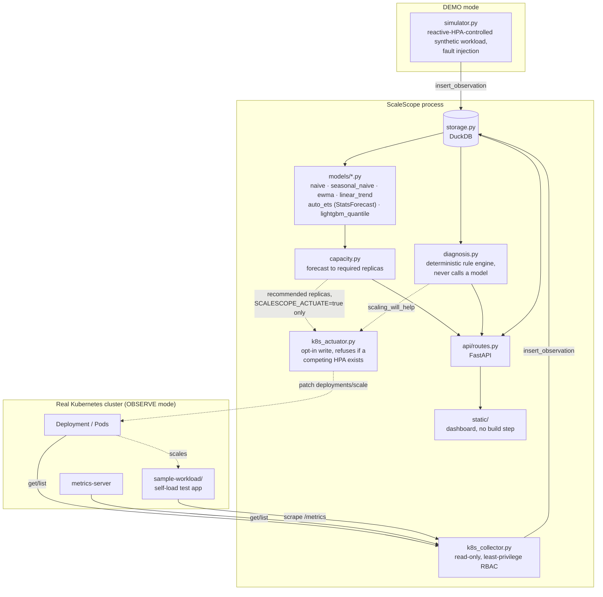
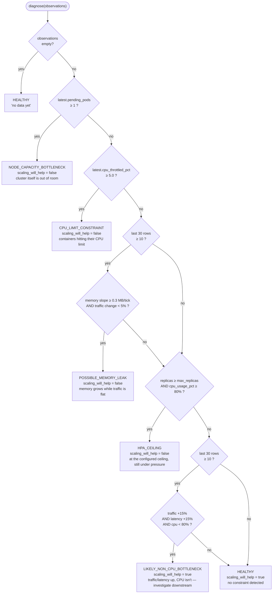
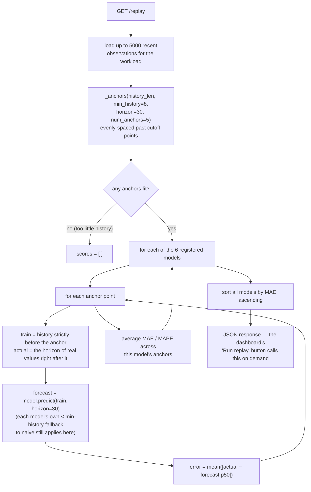
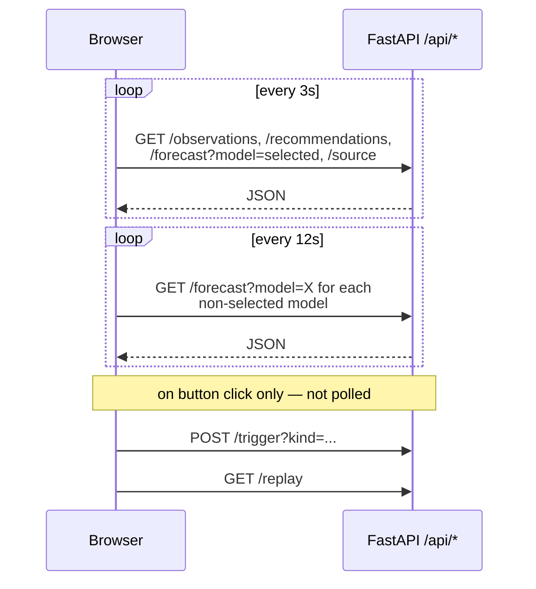
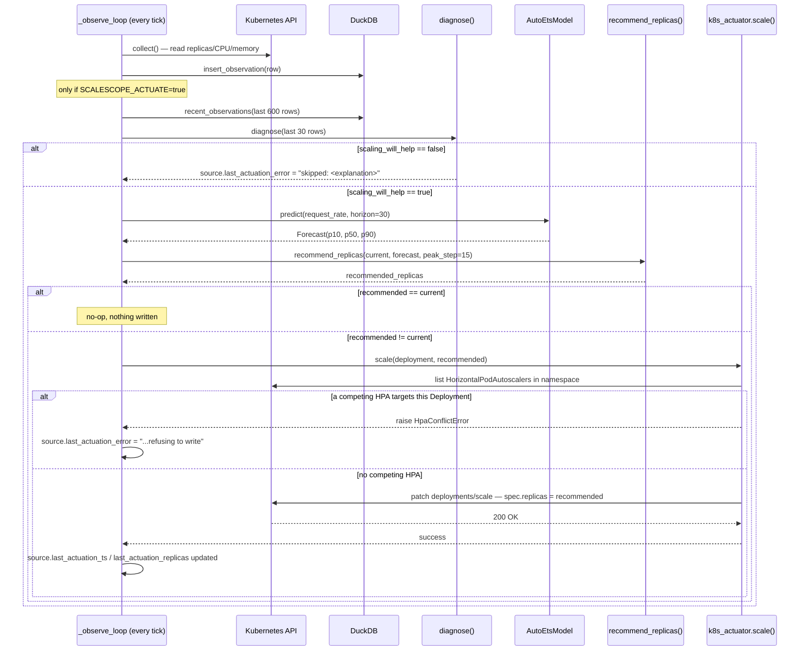
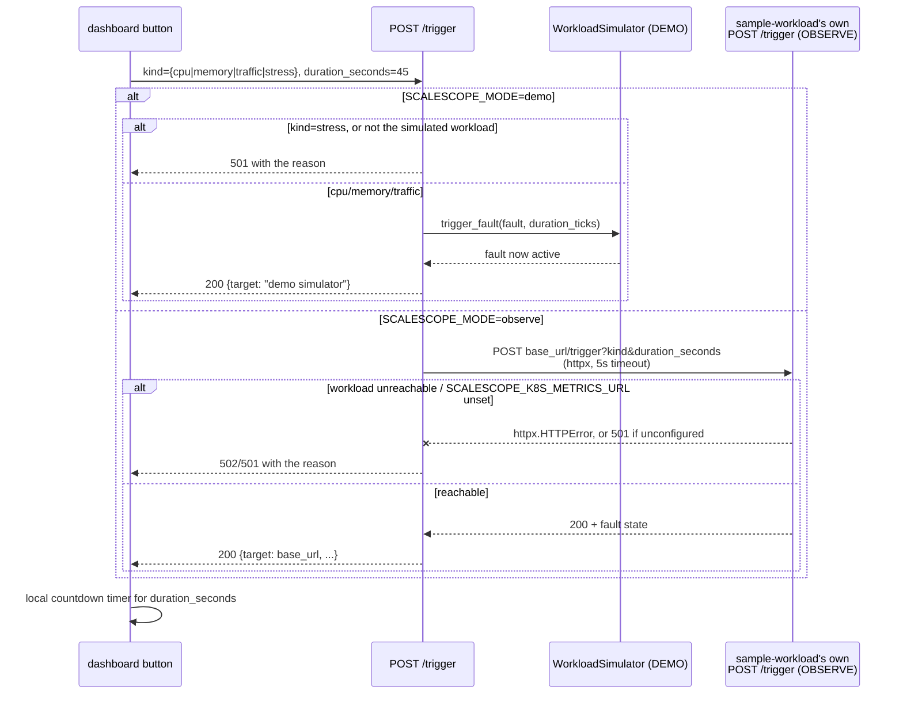

# ScaleScope

Explainable predictive Kubernetes capacity intelligence lab. Forecasts near-term
demand for a workload, computes the replica count required to satisfy it, and
runs that alongside a deterministic diagnosis engine that flags when scaling is
the wrong response (CPU limit throttling, memory leak, node capacity exhaustion,
HPA ceiling, non-CPU bottleneck).

## Status: v0.11.1 (demo + multi-namespace observe + opt-in actuation + on-demand load triggers + replay lab + optional auth, verified against a real cluster)

See [CHANGELOG.md](CHANGELOG.md) for what changed at each version.

Created by James Sawyer.

ScaleScope is a working lab with two supported runtime modes:

- **`SCALESCOPE_MODE=demo`** (default): entirely self-contained against a
  synthetic workload simulator, no Kubernetes cluster needed — `docker
  compose up --build` and you're watching data within seconds.
- **`SCALESCOPE_MODE=observe`**: discovers Deployments across
  `SCALESCOPE_K8S_NAMESPACES`, reads their replicas/CPU/memory from the
  Kubernetes API and metrics-server, and shows them as selectable
  `namespace/deployment` targets. `request_rate`, `latency_p95_ms`, and
  `error_rate` require the workload to expose Prometheus gauges (not
  derivable from the Kubernetes API alone); without that they report as
  `0.0` rather than a fabricated value.

## Screenshots

All three captured from a real running DEMO instance (`docker compose up --build`,
no cluster involved) against the built-in `sample-app` synthetic workload.

### The dashboard


Diagnosis and data freshness up top, then cluster/source identity, the latest
raw observation, the predictive ramp table for the selected model, and all six
forecast models recommending replicas from the same evidence so no single
model's output is taken on faith.

### Diagnosis catching a real problem


Clicking "Leak Memory" in the sidebar forces the DEMO simulator's memory-leak
fault; within a few ticks `diagnosis.py`'s rule engine (never a model) flags
`POSSIBLE_MEMORY_LEAK` and sets `scaling_will_help=false` — memory is growing
while traffic is flat, so adding replicas would mask the leak, not fix it.

### Replay lab


`GET /api/workloads/{name}/replay`, triggered by the dashboard's "Run Replay"
button, backtests every registered model against this workload's own recorded
history — MAE/MAPE per model, sorted best-first — measured accuracy, not a
stated preference for which model to trust.

## Advisory or autoscaling?

Both are supported, but the release default is advisory.

| Deployment shape | Writes replicas? | Intended use |
|---|---:|---|
| DEMO | No | Local dashboard, forecasting, diagnosis, replay, and load-trigger demo |
| OBSERVE advisory | No | Read a real cluster and show recommendations without changing workloads |
| OBSERVE actuation | Yes, opt-in | Patch `deployments/scale` when the forecast recommends a different replica count and diagnosis says scaling will help |

Actuation requires all of the following:

- `SCALESCOPE_MODE=observe`
- `SCALESCOPE_ACTUATE=true`
- RBAC from `k8s/scalescope-actuation/` or equivalent access to
  `deployments/scale`
- no `HorizontalPodAutoscaler` targeting the same Deployment, because
  ScaleScope refuses to fight another replica controller

The dashboard and `GET /api/source` show which cluster identity is connected,
which namespace scope is visible, and whether actuation is enabled.
See [examples/README.md](examples/README.md) for copy-paste deployment paths.

## Architecture



The forecaster never predicts CPU-per-pod directly, because scaling changes
that signal (adding replicas lowers per-pod CPU, which would make the
forecast look self-correcting). It forecasts `request_rate` — a demand signal
that is not mechanically altered by the replica count — then derives
required capacity from a fixed per-pod throughput assumption.

## Forecast models

All six models implement the same `ForecastModel` protocol (`src/scalescope/models/base.py`):
`predict(history, horizon)` on a 1-D `request_rate` array, returning a `Forecast` of `p10`/`p50`/`p90`
arrays. None of them ever sees CPU-per-pod or replica count — see "Architecture" above for why.

The simulated series (`simulator.py`) is a ~300-tick sine-wave daily cycle (amplitude 400 around a
base of 700) plus noise, with occasional faults. Only the `traffic_spike` fault adds directly to
`request_rate` (a flat +600 for the fault's duration); `memory_leak`, `cpu_limit`, and
`node_capacity` faults change memory/CPU/node signals that `diagnosis.py` reads separately — they do
not show up as demand spikes in the series the forecasters fit on.

| Model | Fits on | Min history | Fallback | Reasonable fit | Poor fit |
|---|---|---|---|---|---|
| `naive` | last observed value | none | — | flat/near-term stretches | trending or seasonal periods |
| `seasonal_naive` | the last full cycle of the period `detect_period` finds in the history (the ~300-tick daily cycle in DEMO) | two full cycles (and ≥ 100 ticks) | `naive` until a period is confidently detected | once the cycle is established | cold start, or when a fault in the previous cycle (e.g. a `traffic_spike`) gets replayed |
| `ewma` | exponentially weighted average of the whole history (alpha 0.3), extrapolated flat | none | — | smoothing out noise on a roughly flat series | any series with real trend or seasonality, since it always flattens |
| `linear_trend` | least-squares line over the last 60 points | 8 ticks | `naive` below threshold | short local trends (e.g. climbing into a spike) | the full sine cycle, since a straight line can't turn over |
| `auto_ets` | Nixtla StatsForecast `AutoETS`, exponential-smoothing state space fit to the whole history, 80% prediction interval; `season_length` is the period `detect_period` finds (1 when none is confident) | 30 ticks | `naive`, on short history or if the fit raises | general-purpose statistical fit; better than the baselines once enough history exists | histories shorter than two cycles, where no period is detected and it fits without seasonality |
| `lightgbm_quantile` | three independent LightGBM quantile regressors (p10/p50/p90) over lag (1,2,3,5,10, plus the detected period when there is one) and rolling mean/std(5) features via MLForecast | 60 ticks | `naive`, on short history or if fitting/predicting raises | has enough history and lag structure to pick up the daily cycle and recent spike dynamics | short or noisy history — 60 ticks is barely two lag windows, and quantile crossing (corrected by sorting p10/p50/p90 per step) signals the fit is unstable |

Every baseline computes its p10/p90 band from the standard deviation of first differences in the
history (`_residual_std`), widened linearly with forecast horizon — it is not a statistically
calibrated interval, just a spread proxy. `auto_ets` and `lightgbm_quantile` produce their bands
directly (ETS's 80% interval; independently fit quantile regressors, respectively).

`capacity.py` sizes replicas off `forecast.p90`, not `p50`: `recommend_replicas` takes the max of
the P90 window as `peak_demand` and requires enough replicas to serve that peak at
`TARGET_UTILIZATION` (0.70). Sizing to the median would under-provision for roughly half the
horizon by definition; sizing to the upper quantile is a deliberate peak-not-average safety margin.
`confidence` in the response is derived from the mean P90-minus-P10 band width relative to peak
demand. Forecasts below `MIN_CONFIDENCE_TO_SCALE` (0.10) are still shown for comparison, but they
keep the current replica count instead of driving a scale change.

`GET /api/workloads/{name}/recommendations` (plural) runs every registered model against the same
history and returns all six recommendations side by side, so the dashboard can compare them instead
of committing to one model's output blind. `GET /api/workloads/{name}/recommendation` (singular)
still exists for a single `model=` choice.

Operator-run SMAC3 tuning for `lightgbm_quantile` lives in
[`scripts/tune`](scripts/tune/README.md). It writes an opt-in JSON config for
`SCALESCOPE_LIGHTGBM_CONFIG_PATH`; SMAC3 stays out of the app dependency set.
The same directory also includes a cron-safe periodic re-tuning driver that
copies current DuckDB data from a running compose service, compares the deployed
config against the new candidate on that data, and only restarts services after
a real promotion.

## Diagnosis logic

`diagnosis.py`'s rule ladder, in the exact order `diagnose()` evaluates it. Every
branch that returns `scaling_will_help=false` is a case where adding replicas
would not fix — or would actively mask — the real problem:



Node capacity and CPU-limit checks run on the single latest row (no window
needed); the memory-leak and non-CPU-bottleneck checks need at least 10 rows
of the last-30-row window to compute a slope/delta, so they're skipped (not
failed) below that. `diagnose()` never calls a model — it is deliberately
readable and reviewable independent of any forecast.

## Replay lab

`GET /api/workloads/{name}/replay` (`src/scalescope/replay.py`) answers
"which model actually performs best on this workload's real data," measured,
not asserted — the same "don't take a stated preference on faith" discipline
`diagnosis.py` applies to scaling decisions, applied to model selection:



Deliberately scoped: this backtests a model's forecast against what the
workload's own metrics actually did next, not against what a real
Kubernetes HPA would have decided over the same window — see "Known
limitations" below. It also runs on demand rather than the dashboard's 3s poll
cycle: retraining all 6 models (LightGBM included) across 5 anchor points
takes roughly 2-10 seconds depending on history size and CPU contention,
confirmed live against both a DEMO instance (5000 synthetic rows, ~2s) and
an OBSERVE instance reading a real cluster (~10s).

## Run it

```
docker compose up --build
```

Then open http://localhost:8000. A synthetic workload (`sample-app`) starts
generating observations immediately; the dashboard begins populating within a
few seconds. Data persists in the `scalescope-data` volume across restarts.
The dashboard ships its own DejaVu Sans Mono Regular font and uses that same
face for labels, tables, charts, and metric values.

Environment variables (see `src/scalescope/config.py`):

| Variable | Default | Meaning |
|---|---|---|
| `SCALESCOPE_MODE` | `demo` | `demo` runs the synthetic simulator; `observe` reads a real cluster |
| `SCALESCOPE_TICK_SECONDS` | `2.0` | Seconds between observations (both modes) |
| `SCALESCOPE_DB_PATH` | `/data/scalescope.duckdb` | DuckDB file path |
| `SCALESCOPE_LOG_LEVEL` | `INFO` | Python logging level |
| `SCALESCOPE_HORIZON_STEPS` | `30` | Forecast horizon, in ticks |
| `SCALESCOPE_HISTORY_STEPS` | `600` | Observation history window fed to models |
| `SCALESCOPE_LIGHTGBM_CONFIG_PATH` | unset | Optional LightGBM hyperparameter JSON produced by `scripts/tune` |
| `SCALESCOPE_K8S_NAMESPACE` | `scalescope-demo` | Primary namespace for metrics URL attachment and opt-in actuation |
| `SCALESCOPE_K8S_DEPLOYMENT` | `sample-workload` | Primary deployment for metrics URL attachment and opt-in actuation |
| `SCALESCOPE_K8S_NAMESPACES` | `SCALESCOPE_K8S_NAMESPACE` | Comma-separated namespaces to discover in OBSERVE mode; `*` lists all namespaces visible to the ServiceAccount |
| `SCALESCOPE_K8S_KUBECONFIG` | unset | Kubeconfig path; unset tries in-cluster config, then default kubeconfig discovery |
| `SCALESCOPE_K8S_METRICS_URL` | unset | Primary workload's own `/metrics` URL, for real `request_rate`/`latency_p95_ms`/`error_rate` and `/trigger` proxying |
| `SCALESCOPE_ACTUATE` | `false` | Observe mode only: actually write recommended replica counts to the cluster (see "Actuation" below) |
| `SCALESCOPE_AUTH_USERNAME` | unset | HTTP Basic Auth username for every route (see "Authentication" below) |
| `SCALESCOPE_AUTH_PASSWORD` | unset | HTTP Basic Auth password; both must be set together |

To fully tear down and rebuild against the latest dependency versions
`pyproject.toml` allows, run `./scripts/rebuild.sh`. It records the resolved
package set to `requirements-lock.txt` and leaves the service(s) running
(via `docker compose`) once built and health-checked.

- `./scripts/rebuild.sh` — DEMO instance only (`localhost:8000`).
- `./scripts/rebuild.sh --observe` — also tears down/rebuilds the OBSERVE
  instance (`localhost:8001`); requires `k8s/rbac/` already applied and a
  kubeconfig from `generate-observer-kubeconfig.sh` (see below).
- `./scripts/rebuild.sh --wipe-data` — also drops the DuckDB volume(s), for
  a clean-slate rebuild instead of preserving history across it.

### Verify a running instance

For DEMO mode, these checks should all return HTTP 200 after either
`docker compose up --build` or `./scripts/rebuild.sh`:

```
curl -fs http://localhost:8000/healthz
curl -fs http://localhost:8000/api/source
curl -fs http://localhost:8000/api/workloads
curl -fs "http://localhost:8000/api/workloads/sample-app/recommendations"
```

If Basic Auth is enabled, add
`-u "$SCALESCOPE_AUTH_USERNAME:$SCALESCOPE_AUTH_PASSWORD"` to the API
requests. `./scripts/rebuild.sh` performs these smoke checks automatically
and leaves the healthy service running.

For OBSERVE mode, replace the URL with `http://localhost:8001` for local
Docker OBSERVE mode, or port-forward the in-cluster Service first:

```
kubectl -n scalescope-system port-forward svc/scalescope 8000:80
curl -fs http://localhost:8000/api/source
curl -fs http://localhost:8000/api/workloads
```

`/api/source` should show `mode: observe`, `connected: true`, the cluster
server, the authentication identity, and the namespace scope. Workload IDs
are returned as `namespace:deployment`; use one of those IDs when calling
forecast, recommendation, diagnosis, replay, or trigger endpoints.

### Authentication

Both `SCALESCOPE_AUTH_USERNAME` and `SCALESCOPE_AUTH_PASSWORD` unset (the
default): no authentication — every route, including the dashboard itself,
is open. This is an explicit supported mode for trusted-LAN or homelab
operators who deliberately accept that risk. Setting exactly one of the two
auth variables is a startup configuration error; ScaleScope refuses that
state rather than silently disabling auth. Running without credentials logs
a startup warning (including when `SCALESCOPE_ACTUATE=true`) and still starts.
Set both variables to enable HTTP Basic Auth
(`src/scalescope/auth.py`, applied as ASGI middleware so it covers the
static dashboard files as well as `/api/*`, not just the API):

- `GET /healthz` is the one exempt route (unauthenticated liveness check;
  the Docker `HEALTHCHECK` uses it).
- Browsers handle the login prompt natively — no dashboard login form was
  built. The first page load triggers the browser's built-in Basic Auth
  dialog; credentials are then cached by the browser and attached to every
  subsequent `fetch()` call automatically.
- `docker-compose.yml` passes `SCALESCOPE_AUTH_USERNAME`/`_PASSWORD`
  through from `.env` to both services if set there (see
  `.env.example`). `scripts/rebuild.sh`'s own smoke-test curls read the
  same `.env` file directly and authenticate if configured.

### Release security model

ScaleScope ships with a safe default network shape, not a universal
authentication policy. The Kubernetes Service in `k8s/scalescope/` is
`ClusterIP`, OBSERVE mode is read-only unless actuation is explicitly enabled,
and the optional Basic Auth Secret provides a simple app-level guard for demos,
homelabs, and trusted internal paths.

Production operators are responsible for the exposure layer that matches their
environment. Do not expose ScaleScope unauthenticated on an untrusted network;
configure either `SCALESCOPE_AUTH_USERNAME`/`SCALESCOPE_AUTH_PASSWORD` through
the `scalescope-auth` Secret, or put the Service behind an ingress, gateway,
VPN, SSO proxy, mTLS policy, or other organization-approved control with TLS.

Namespace visibility is also a deployment-time authorization decision.
ScaleScope only discovers and displays the namespaces and Deployments its
ServiceAccount can read. For least privilege, bind the ServiceAccount to the
specific namespaces users are allowed to inspect; use
`SCALESCOPE_K8S_NAMESPACES=*` only when cluster-wide visibility is intended.
Apply `k8s/scalescope-actuation/` and set `SCALESCOPE_ACTUATE=true` only for
environments where ScaleScope is authorized to change replica counts.

### What the dashboard fetches, and when

`static/app.js`'s `refresh()` runs every `POLL_INTERVAL_MS` (3s); the
5 non-selected models' forecasts are only refetched every 12s to avoid
firing 6 forecast requests on every 3s tick. Replay and load triggers are
explicit button actions, never polled:



## Wiring in a real cluster (OBSERVE mode)

`src/scalescope/k8s_collector.py` discovers Deployments in
`SCALESCOPE_K8S_NAMESPACES` and reads each target's state via the Kubernetes
API (`get`/`list` on Deployments and Pods, `get`/`list` on
metrics.k8s.io PodMetrics if metrics-server is installed). Workloads are
stored as `namespace:deployment`, and the dashboard labels them as
`namespace/deployment` so users can choose the target they want recommendations
for.

For a real in-cluster install, build and push the Docker image, set
`k8s/scalescope/deployment.yaml`'s `image:` to that registry reference, then:

```
kubectl apply -f k8s/scalescope/
kubectl -n scalescope-system port-forward svc/scalescope 8000:80
```

The bundled Service is `ClusterIP`, so it is internal to the cluster unless
you add an Ingress, load balancer, or port-forward. If you expose it beyond a
trusted local demo path, create the optional Basic Auth Secret before rolling
the Deployment:

```
kubectl -n scalescope-system create secret generic scalescope-auth \
  --from-literal=username="$SCALESCOPE_AUTH_USERNAME" \
  --from-literal=password="$SCALESCOPE_AUTH_PASSWORD"
```

`k8s/scalescope/` is observe-only. To let ScaleScope write replica counts as
well, set `SCALESCOPE_ACTUATE=true` on the Deployment and apply the separate
actuation RBAC:

```
kubectl apply -f k8s/scalescope-actuation/
```

For local Docker OBSERVE mode, `k8s/rbac/` still defines a namespace-scoped
identity and standalone kubeconfig:

1. `kubectl apply -f k8s/rbac/` — creates the `scalescope-demo` namespace, a
   `scalescope-actuator` ServiceAccount, a namespace-scoped Role (the read
   verbs above, plus write access scoped to the `deployments/scale`
   subresource only — never full deployments, so this identity can change a
   replica count and nothing else about the workload — and read access to
   `horizontalpodautoscalers` for the conflict check below; no secrets
   access beyond its own token, nothing cluster-scoped), and a durable
   token Secret for it.
2. `./scripts/generate-observer-kubeconfig.sh` — renders a standalone
   kubeconfig for that ServiceAccount (`OUTPUT_PATH` env var to change where
   it's written; defaults to `./scalescope-observer.kubeconfig`). **This file
   contains a live cluster credential — never commit it** (already covered by
   `.gitignore`).
3. Deploy something to observe — `sample-workload/` (below) is a ready-made
   test target. Then either `./scripts/rebuild.sh --observe` (brings up
   both DEMO and OBSERVE via `docker compose`, reading `SCALESCOPE_K8S_*`
   overrides from `.env` — see `.env.example`), or run ScaleScope directly
   with `SCALESCOPE_MODE=observe`, `SCALESCOPE_K8S_KUBECONFIG` pointed at
   the generated file, and `SCALESCOPE_K8S_NAMESPACE`/
   `SCALESCOPE_K8S_DEPLOYMENT` set to match.

Verify the identity is actually scoped before trusting it:
`kubectl --kubeconfig=./scalescope-observer.kubeconfig auth can-i delete pods -n scalescope-demo`
must say `no`.

`GET /api/source` reports what a running instance is actually observing —
mode, cluster server address, namespace/deployment, and live connection
status — so DEMO and OBSERVE are never visually ambiguous in the dashboard.

### Actuation: letting ScaleScope actually change replica counts

`SCALESCOPE_MODE=observe` alone is always read-only. Setting
`SCALESCOPE_ACTUATE=true` on top of it makes the observe loop, every tick,
compute a recommendation and — only if the diagnosis engine says scaling
will actually help — call `src/scalescope/k8s_actuator.py` to patch the
target Deployment's `spec.replicas` via the `deployments/scale`
subresource.

**Before writing, it checks whether a `HorizontalPodAutoscaler` already
targets the same Deployment, and refuses if one does.** Two controllers
writing the same replica count fight each other: the HPA reconciles
continuously and will simply overwrite ScaleScope's write within seconds,
so the *only* safe default is refusing outright, not warning and
proceeding. `sample-workload/k8s/hpa.yaml` installs a real HPA on the demo
target by design (so there's a baseline to compare against) — actuation
against it will therefore refuse until you remove that HPA
(`kubectl delete hpa sample-workload -n scalescope-demo`) and let
ScaleScope be the sole controller.

`GET /api/source` also reports actuation state: `actuate`,
`last_actuation_ts`, `last_actuation_replicas`, and
`last_actuation_error` (populated whether the failure was an HPA conflict
or an API error, so "why didn't it scale" is never a silent question) -
the dashboard sidebar shows this as an "actuation" row whenever
`actuate=true` in observe mode.

Exact sequence, once per tick, straight from `main.py`'s `_observe_loop` /
`_actuate` and `k8s_actuator.py`'s `scale`:



### sample-workload/

A self-contained FastAPI test target with no external load generator
required: a background task randomizes its own CPU load, a bounded
self-recovering simulated memory leak, and error injection, so deploying it
alone produces a real, varying pattern for a Kubernetes HPA (and ScaleScope)
to react to. Exposes `sample_workload_demand_rps`/`latency_p95_ms`/
`error_rate` Prometheus gauges — point `SCALESCOPE_K8S_METRICS_URL` at its
`/metrics` endpoint to get real values for those fields instead of `0.0`.
Its own `/timeline/pause`, `/timeline/resume`, and `/timeline/status`
endpoints can freeze the background phase progression during controlled
OBSERVE-mode tests.
See `sample-workload/README.md` for build/push/deploy instructions.

## On-demand load triggers

The dashboard's "Generate load" buttons call `POST /api/workloads/{name}/trigger`,
which forces a pattern immediately instead of waiting for it to occur
naturally, so its effect on the metrics and diagnosis is visible within a
few ticks. The route branches on `SCALESCOPE_MODE` (from `api/routes.py`'s
`trigger_fault`):



`stress` is OBSERVE-only because it runs a real bounded CPU worker inside
sample-workload processes; the synthetic DEMO simulator has no equivalent
process to stress. `base_url` is derived from
`SCALESCOPE_K8S_METRICS_URL` (its `/metrics` suffix stripped) —
ScaleScope has no other route to the workload's process, so OBSERVE-mode
triggers require that variable to be set.

## API

- `GET /healthz` — unauthenticated liveness check, the only exempt route
  when Basic Auth is enabled (see "Authentication" above)
- `GET /api/workloads`
- `GET /api/workloads/{name}/observations?limit=300`
- `GET /api/workloads/{name}/forecast?model={naive|seasonal_naive|ewma|linear_trend|auto_ets|lightgbm_quantile}`
- `GET /api/workloads/{name}/diagnosis`
- `GET /api/workloads/{name}/recommendation?model=...`
- `GET /api/workloads/{name}/recommendations` — all six models, side by side
- `GET /api/workloads/{name}/replay` — backtests every model against this
  workload's recorded history (MAE/MAPE, sorted best first) — what the
  dashboard's "Replay lab" panel calls on demand
- `GET /api/source` — what this instance is actually observing (mode, cluster, connection status)
- `POST /api/workloads/{name}/trigger?kind={cpu|memory|traffic|stress}&duration_seconds=45` — force a load
  pattern now (DEMO: the local simulator; OBSERVE: proxied to the real workload's own `/trigger`,
  requires `SCALESCOPE_K8S_METRICS_URL`; `stress` is OBSERVE-only) — what the dashboard's
  "Generate load" buttons call

## Develop locally

```
python3.14 -m venv .venv && source .venv/bin/activate
pip install -e ".[dev]"
uvicorn scalescope.main:app --reload
pytest
mypy
black src tests sample-workload/app scripts/tune
ruff check .
```

## License

ScaleScope is licensed under the Apache License 2.0. Copyright 2026 James
Sawyer. See [LICENSE](LICENSE) and [NOTICE](NOTICE).

The bundled DejaVu Sans Mono Regular font keeps its own license in
`src/scalescope/static/fonts/DejaVu-LICENSE.txt`.

## Known limitations

- **`cpu_throttled_pct` in OBSERVE mode**: needs cAdvisor
  `container_cpu_cfs_throttled` data, not exposed by the Kubernetes API or
  metrics-server; always `0.0` when observing a real cluster.
- **Replay lab vs. real HPA behavior**: the current replay lab
  (`GET /api/workloads/{name}/replay`, see "API" above) backtests every
  model against the workload's own subsequent recorded values (MAE/MAPE
  per model) — it does not yet compare against what a real Kubernetes HPA
  would have decided over the same recorded window.
- Per-workload Prometheus metrics URL discovery. Today,
  `SCALESCOPE_K8S_METRICS_URL` attaches request/latency/error metrics and
  `/trigger` proxying to the primary
  `SCALESCOPE_K8S_NAMESPACE`/`SCALESCOPE_K8S_DEPLOYMENT` target; other
  discovered Deployments use Kubernetes replica/CPU/memory signals only.
